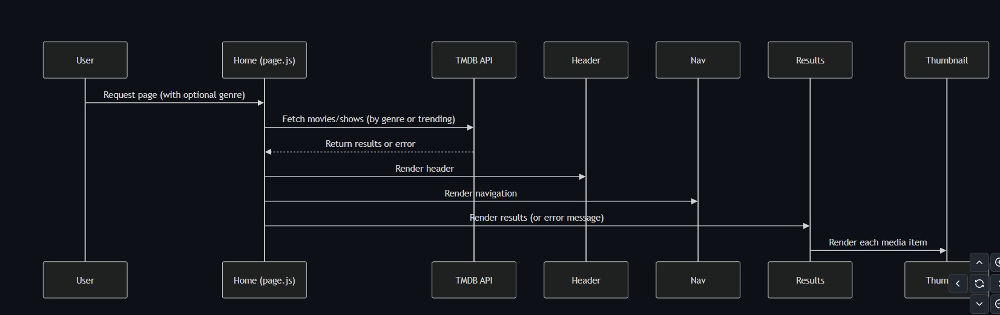

# Hulu Clone



A modern Hulu clone built with Next.js 15, featuring movie and TV show browsing by genre, responsive design, and real-time data from TMDB API.

## Features

- **Genre-based Browsing**: Navigate through different categories including Trending, Top Rated, Action, Comedy, Horror, and more
- **Responsive Design**: Fully responsive layout that works on mobile, tablet, and desktop
- **Modern UI**: Clean interface with smooth animations and transitions
- **Server Components**: Leverages Next.js 15's server components for improved performance
- **Image Optimization**: Uses Next.js Image component for optimized image loading

## Tech Stack

- **Framework**: [Next.js 15](https://nextjs.org/)
- **Styling**: [Tailwind CSS](https://tailwindcss.com/)
- **Icons**: [Heroicons](https://heroicons.com/)
- **Animation**: [React Flip Move](https://github.com/joshwcomeau/react-flip-move)
- **Data**: [TMDB API](https://www.themoviedb.org/documentation/api)

## Getting Started

First, run the development server:

```bash
npm run dev
# or
yarn dev
# or
pnpm dev
# or
bun dev
```

Open [http://localhost:3000](http://localhost:3000) with your browser to see the result.

You can start editing the page by modifying `app/page.js`. The page auto-updates as you edit the file.

## Environment Variables

Create a `.env.local` file in the root directory with the following variables:

```
API_KEY=your_tmdb_api_key
```

You can obtain an API key by creating an account on [The Movie Database](https://www.themoviedb.org/).

## Project Structure

```
/src
  /app
    /components      # Reusable UI components
    /utils           # Utility functions and API requests
    globals.css      # Global styles
    layout.js        # Root layout component
    page.js          # Home page component
  /public            # Static assets
```

## Performance Optimizations

- Server-side rendering for initial page load
- Image optimization with Next.js Image component
- Caching API responses with revalidation
- Error boundaries for graceful error handling

## Deployment

The easiest way to deploy your Next.js app is to use the [Vercel Platform](https://vercel.com/new?utm_medium=default-template&filter=next.js&utm_source=create-next-app&utm_campaign=create-next-app-readme) from the creators of Next.js.

Check out the [Next.js deployment documentation](https://nextjs.org/docs/app/building-your-application/deploying) for more details.

## Learn More

To learn more about Next.js, take a look at the following resources:

- [Next.js Documentation](https://nextjs.org/docs) - learn about Next.js features and API.
- [Learn Next.js](https://nextjs.org/learn) - an interactive Next.js tutorial.

## License

This project is open source and available under the [MIT License](LICENSE).

